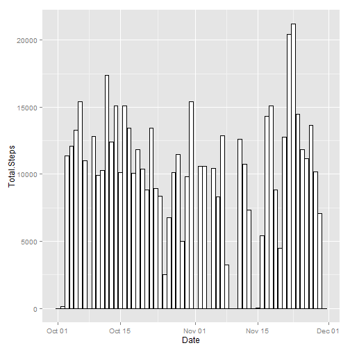
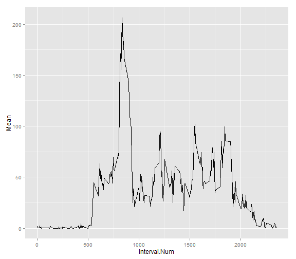
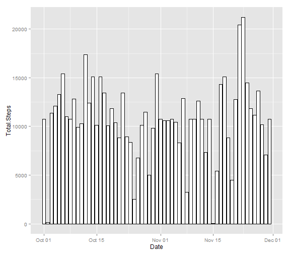
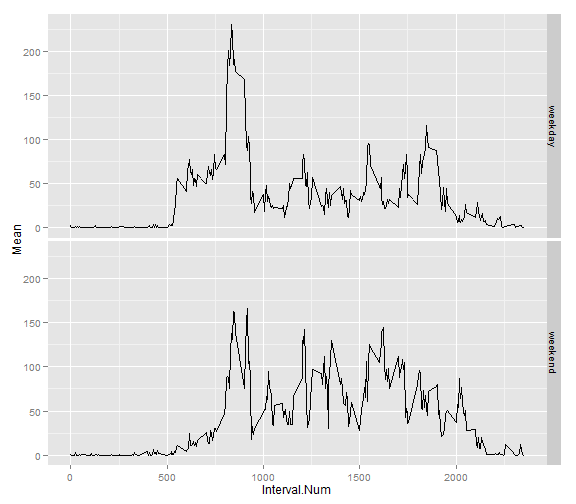

# Reproducible Research: Peer Assessment 1

## Loading and preprocessing the data

First, the activity data has to be downloaded and saved.  Then we load the data onto R.  Then we process the data into a format that is most suitable.  For example, the date information should be classified as date, and not as numerics or characters. Here is how we load and process the data:


```r
data <- read.csv("~/activity.csv", header = TRUE, stringsAsFactors = FALSE)
data$date <- as.Date(data$date, "%Y-%m-%d")
head(data)  #checking out the top of the data
```

```
##   steps       date interval
## 1    NA 2012-10-01        0
## 2    NA 2012-10-01        5
## 3    NA 2012-10-01       10
## 4    NA 2012-10-01       15
## 5    NA 2012-10-01       20
## 6    NA 2012-10-01       25
```

```r
str(data)   #checking out the structure of the data and the columns are correctly defined
```

```
## 'data.frame':	17568 obs. of  3 variables:
##  $ steps   : int  NA NA NA NA NA NA NA NA NA NA ...
##  $ date    : Date, format: "2012-10-01" "2012-10-01" ...
##  $ interval: int  0 5 10 15 20 25 30 35 40 45 ...
```


## What is mean total number of steps taken per day?
We will ignore the missing values in the dataset for now, and make a histogram of the total number of steps taken each day.  Before we can make the histogram graph, we must use aggregate function to sum the steps by day.


```r
sumStepsPerDay <- aggregate(data$steps, by = list(data$date), FUN = sum, na.rm = TRUE ) 
head(sumStepsPerDay)
```

```
##      Group.1     x
## 1 2012-10-01     0
## 2 2012-10-02   126
## 3 2012-10-03 11352
## 4 2012-10-04 12116
## 5 2012-10-05 13294
## 6 2012-10-06 15420
```

```r
# Note that the column names are not obvious, so we update them
names(sumStepsPerDay)[1] <- "Date"   
names(sumStepsPerDay)[2] <- "Total.Steps"
```

With the sums that we've calculated, we can use it to create the histogram.
We use ggplot plotting systems.

```r
library(ggplot2)
ggplot(sumStepsPerDay, aes(x=Date, y=Total.Steps)) + 
  geom_bar(stat="identity", fill="white", colour="black")
```

 

Here we calculate and report the mean and median total number of steps taken per day, by using the aggregate function again.

```r
meanStepsPerDay <- aggregate(data$steps, by = list(data$date), FUN = mean, na.rm = TRUE )
names(meanStepsPerDay)[1] <- "Date"
names(meanStepsPerDay)[2] <- "Mean.Steps"
head(meanStepsPerDay)
```

```
##         Date Mean.Steps
## 1 2012-10-01        NaN
## 2 2012-10-02     0.4375
## 3 2012-10-03    39.4167
## 4 2012-10-04    42.0694
## 5 2012-10-05    46.1597
## 6 2012-10-06    53.5417
```

```r
medianStepsPerDay <- aggregate(data$steps, by = list(data$date), FUN = median, na.rm = TRUE ) 
names(medianStepsPerDay)[1] <- "Date"
names(medianStepsPerDay)[2] <- "Median.Steps"
head(medianStepsPerDay)
```

```
##         Date Median.Steps
## 1 2012-10-01           NA
## 2 2012-10-02            0
## 3 2012-10-03            0
## 4 2012-10-04            0
## 5 2012-10-05            0
## 6 2012-10-06            0
```
Note that the median is all zeros for all dates.  Unless there were missing values, then the reported median is NA.


## What is the average daily activity pattern?
We can find this out by, again, using the aggregate function.  This time, be sure to find the mean by interval, and not date.

```r
meanStepsPerInterval <- aggregate(data$steps, by = list(data$interval), FUN = mean, na.rm = TRUE ) 
names(meanStepsPerInterval)[1] <- "Interval.Num"
names(meanStepsPerInterval)[2] <- "Mean"
```
With the information that we've just calculated, we can make a time series plot.

```r
ggplot(meanStepsPerInterval, aes(x=Interval.Num, y=Mean))+ 
  geom_line()
```

 
So we see for each 5 min interval, what is the average number of steps taken, averaged across all days. The line peak at around 700-800 interval number.

If we want to know exactly which 5 min interval, on average contains the maximum number of steps, then execute the following:

```r
meanStepsPerInterval[which.max(meanStepsPerInterval[,2]),]
```

```
##     Interval.Num  Mean
## 104          835 206.2
```
We see that at interval number 835, the highest average number of steps is 206 steps per that 5 minute interval.


## Imputing missing values
Total number of rows with NAs:

```r
sum(is.na(data))
```

```
## [1] 2304
```

Our strategy for filling in all the missing value is to use the mean for that 5-min interval.
We create a new dataset that is equal to the original dataset, but with the missing data filled in.
The new dataset is called, dataFilledin.

```r
dataFilledIn <- data

for(i in seq(0, 2355, by = 5)){
#use the mean for that 5-minute interval to fill in the NAs
dataFilledIn[(dataFilledIn$interval==i),][,1][is.na(dataFilledIn[(dataFilledIn$interval==i),][,1])] <- unlist(
  (meanStepsPerInterval[(meanStepsPerInterval$Interval.Num==i),][1, 2])
  )
}

head(data)
```

```
##   steps       date interval
## 1    NA 2012-10-01        0
## 2    NA 2012-10-01        5
## 3    NA 2012-10-01       10
## 4    NA 2012-10-01       15
## 5    NA 2012-10-01       20
## 6    NA 2012-10-01       25
```

```r
head(meanStepsPerInterval)
```

```
##   Interval.Num    Mean
## 1            0 1.71698
## 2            5 0.33962
## 3           10 0.13208
## 4           15 0.15094
## 5           20 0.07547
## 6           25 2.09434
```

```r
head(dataFilledIn)   #We want to check that the NAs are filled in correctly
```

```
##     steps       date interval
## 1 1.71698 2012-10-01        0
## 2 0.33962 2012-10-01        5
## 3 0.13208 2012-10-01       10
## 4 0.15094 2012-10-01       15
## 5 0.07547 2012-10-01       20
## 6 2.09434 2012-10-01       25
```

We make a histogram of the total number of steps taken each day with the dataFilledIn set.


```r
sumStepsPerDay_dataFilledIn <- aggregate(dataFilledIn$steps, by = list(dataFilledIn$date), FUN = sum, na.rm = TRUE )  
#We use aggregate and rename the columns again like we did on the original dataset
names(sumStepsPerDay_dataFilledIn)[1] <- "Date"
names(sumStepsPerDay_dataFilledIn)[2] <- "Total.Steps"

ggplot(sumStepsPerDay_dataFilledIn, aes(x=Date, y=Total.Steps)) + 
  geom_bar(stat="identity", fill="white", colour="black")
```

 

We calculate and report the mean and median using the dataFilledIn set.

```r
meanStepsPerDay_dataFilledIn <- aggregate(dataFilledIn$steps, by = list(dataFilledIn$date), FUN = mean, na.rm = TRUE )
names(meanStepsPerDay_dataFilledIn)[1] <- "Date"
names(meanStepsPerDay_dataFilledIn)[2] <- "Mean.Steps"
head(meanStepsPerDay_dataFilledIn)
```

```
##         Date Mean.Steps
## 1 2012-10-01    37.3826
## 2 2012-10-02     0.4375
## 3 2012-10-03    39.4167
## 4 2012-10-04    42.0694
## 5 2012-10-05    46.1597
## 6 2012-10-06    53.5417
```

```r
medianStepsPerDay_dataFilledIn <- aggregate(dataFilledIn$steps, by = list(dataFilledIn$date), FUN = median, na.rm = TRUE ) 
names(medianStepsPerDay_dataFilledIn)[1] <- "Date"
names(medianStepsPerDay_dataFilledIn)[2] <- "Median.Steps"
head(medianStepsPerDay_dataFilledIn)
```

```
##         Date Median.Steps
## 1 2012-10-01        34.11
## 2 2012-10-02         0.00
## 3 2012-10-03         0.00
## 4 2012-10-04         0.00
## 5 2012-10-05         0.00
## 6 2012-10-06         0.00
```
Do these values differ from the estimates from the first part of the assignment ? What is the impact of imputing missing data on the estimates of the total daily number of steps?

The total daily number of steps changed in that there are more bars, instead of empty spaces.  However, the peak around Nov 20 is still there.  Note the differences and similarities between the 2 histograms.

To look at the differences in mean and median, let's merge the data frames and compare!

```r
compareMean <- merge(meanStepsPerDay, meanStepsPerDay_dataFilledIn, by= "Date")
compareMean
```

```
##          Date Mean.Steps.x Mean.Steps.y
## 1  2012-10-01          NaN      37.3826
## 2  2012-10-02       0.4375       0.4375
## 3  2012-10-03      39.4167      39.4167
## 4  2012-10-04      42.0694      42.0694
## 5  2012-10-05      46.1597      46.1597
## 6  2012-10-06      53.5417      53.5417
## 7  2012-10-07      38.2465      38.2465
## 8  2012-10-08          NaN      37.3826
## 9  2012-10-09      44.4826      44.4826
## 10 2012-10-10      34.3750      34.3750
## 11 2012-10-11      35.7778      35.7778
## 12 2012-10-12      60.3542      60.3542
## 13 2012-10-13      43.1458      43.1458
## 14 2012-10-14      52.4236      52.4236
## 15 2012-10-15      35.2049      35.2049
## 16 2012-10-16      52.3750      52.3750
## 17 2012-10-17      46.7083      46.7083
## 18 2012-10-18      34.9167      34.9167
## 19 2012-10-19      41.0729      41.0729
## 20 2012-10-20      36.0938      36.0938
## 21 2012-10-21      30.6285      30.6285
## 22 2012-10-22      46.7361      46.7361
## 23 2012-10-23      30.9653      30.9653
## 24 2012-10-24      29.0104      29.0104
## 25 2012-10-25       8.6528       8.6528
## 26 2012-10-26      23.5347      23.5347
## 27 2012-10-27      35.1354      35.1354
## 28 2012-10-28      39.7847      39.7847
## 29 2012-10-29      17.4236      17.4236
## 30 2012-10-30      34.0938      34.0938
## 31 2012-10-31      53.5208      53.5208
## 32 2012-11-01          NaN      37.3826
## 33 2012-11-02      36.8056      36.8056
## 34 2012-11-03      36.7049      36.7049
## 35 2012-11-04          NaN      37.3826
## 36 2012-11-05      36.2465      36.2465
## 37 2012-11-06      28.9375      28.9375
## 38 2012-11-07      44.7326      44.7326
## 39 2012-11-08      11.1771      11.1771
## 40 2012-11-09          NaN      37.3826
## 41 2012-11-10          NaN      37.3826
## 42 2012-11-11      43.7778      43.7778
## 43 2012-11-12      37.3785      37.3785
## 44 2012-11-13      25.4722      25.4722
## 45 2012-11-14          NaN      37.3826
## 46 2012-11-15       0.1424       0.1424
## 47 2012-11-16      18.8924      18.8924
## 48 2012-11-17      49.7882      49.7882
## 49 2012-11-18      52.4653      52.4653
## 50 2012-11-19      30.6979      30.6979
## 51 2012-11-20      15.5278      15.5278
## 52 2012-11-21      44.3993      44.3993
## 53 2012-11-22      70.9271      70.9271
## 54 2012-11-23      73.5903      73.5903
## 55 2012-11-24      50.2708      50.2708
## 56 2012-11-25      41.0903      41.0903
## 57 2012-11-26      38.7569      38.7569
## 58 2012-11-27      47.3819      47.3819
## 59 2012-11-28      35.3576      35.3576
## 60 2012-11-29      24.4688      24.4688
## 61 2012-11-30          NaN      37.3826
```

```r
compareMedian <- merge(medianStepsPerDay, medianStepsPerDay_dataFilledIn , by="Date")
compareMedian
```

```
##          Date Median.Steps.x Median.Steps.y
## 1  2012-10-01             NA          34.11
## 2  2012-10-02              0           0.00
## 3  2012-10-03              0           0.00
## 4  2012-10-04              0           0.00
## 5  2012-10-05              0           0.00
## 6  2012-10-06              0           0.00
## 7  2012-10-07              0           0.00
## 8  2012-10-08             NA          34.11
## 9  2012-10-09              0           0.00
## 10 2012-10-10              0           0.00
## 11 2012-10-11              0           0.00
## 12 2012-10-12              0           0.00
## 13 2012-10-13              0           0.00
## 14 2012-10-14              0           0.00
## 15 2012-10-15              0           0.00
## 16 2012-10-16              0           0.00
## 17 2012-10-17              0           0.00
## 18 2012-10-18              0           0.00
## 19 2012-10-19              0           0.00
## 20 2012-10-20              0           0.00
## 21 2012-10-21              0           0.00
## 22 2012-10-22              0           0.00
## 23 2012-10-23              0           0.00
## 24 2012-10-24              0           0.00
## 25 2012-10-25              0           0.00
## 26 2012-10-26              0           0.00
## 27 2012-10-27              0           0.00
## 28 2012-10-28              0           0.00
## 29 2012-10-29              0           0.00
## 30 2012-10-30              0           0.00
## 31 2012-10-31              0           0.00
## 32 2012-11-01             NA          34.11
## 33 2012-11-02              0           0.00
## 34 2012-11-03              0           0.00
## 35 2012-11-04             NA          34.11
## 36 2012-11-05              0           0.00
## 37 2012-11-06              0           0.00
## 38 2012-11-07              0           0.00
## 39 2012-11-08              0           0.00
## 40 2012-11-09             NA          34.11
## 41 2012-11-10             NA          34.11
## 42 2012-11-11              0           0.00
## 43 2012-11-12              0           0.00
## 44 2012-11-13              0           0.00
## 45 2012-11-14             NA          34.11
## 46 2012-11-15              0           0.00
## 47 2012-11-16              0           0.00
## 48 2012-11-17              0           0.00
## 49 2012-11-18              0           0.00
## 50 2012-11-19              0           0.00
## 51 2012-11-20              0           0.00
## 52 2012-11-21              0           0.00
## 53 2012-11-22              0           0.00
## 54 2012-11-23              0           0.00
## 55 2012-11-24              0           0.00
## 56 2012-11-25              0           0.00
## 57 2012-11-26              0           0.00
## 58 2012-11-27              0           0.00
## 59 2012-11-28              0           0.00
## 60 2012-11-29              0           0.00
## 61 2012-11-30             NA          34.11
```
So by imputing missing data, we didn't change the mean of each date except for the ones that have NaNs.  We also didn't change the median except for the ones that have NAs.


##Are there differences in activity patterns between weekdays and weekends?
First, we have to create a new factor variable in the dataset with 2 levels, "weekday" and "weekend".  The factor variable, weekdayOrWeekend, will indicate whether a given date is a weekday or weekend day.


```r
dataFilledIn$day <- (weekdays(dataFilledIn$date))
str(dataFilledIn)  #check that day is a character
```

```
## 'data.frame':	17568 obs. of  4 variables:
##  $ steps   : num  1.717 0.3396 0.1321 0.1509 0.0755 ...
##  $ date    : Date, format: "2012-10-01" "2012-10-01" ...
##  $ interval: int  0 5 10 15 20 25 30 35 40 45 ...
##  $ day     : chr  "Monday" "Monday" "Monday" "Monday" ...
```

```r
dataFilledIn$weekdayOrWeekend <- ifelse(dataFilledIn$day == "Sunday" | dataFilledIn$day == "Saturday", "weekend", "weekday")
head(dataFilledIn)
```

```
##     steps       date interval    day weekdayOrWeekend
## 1 1.71698 2012-10-01        0 Monday          weekday
## 2 0.33962 2012-10-01        5 Monday          weekday
## 3 0.13208 2012-10-01       10 Monday          weekday
## 4 0.15094 2012-10-01       15 Monday          weekday
## 5 0.07547 2012-10-01       20 Monday          weekday
## 6 2.09434 2012-10-01       25 Monday          weekday
```

Use this line of code to spot check that the days of the week are labeled correctly.

```r
dataFilledIn[dataFilledIn$day == "Sunday",]
```

Make sure that the variable, weekdayOrWeekend, is a factor with 2 levels.

```r
dataFilledIn$weekdayOrWeekend <- as.factor(dataFilledIn$weekdayOrWeekend)
str(dataFilledIn)
```

```
## 'data.frame':	17568 obs. of  5 variables:
##  $ steps           : num  1.717 0.3396 0.1321 0.1509 0.0755 ...
##  $ date            : Date, format: "2012-10-01" "2012-10-01" ...
##  $ interval        : int  0 5 10 15 20 25 30 35 40 45 ...
##  $ day             : chr  "Monday" "Monday" "Monday" "Monday" ...
##  $ weekdayOrWeekend: Factor w/ 2 levels "weekday","weekend": 1 1 1 1 1 1 1 1 1 1 ...
```

With the additional information on the type of the day the date is, we can make a time series plot separated by weekday versus weekend.

```r
#Divide the dataset to 2 different ones, weekday vs. weekend
dataFilledInWeekday <- dataFilledIn[dataFilledIn$weekdayOrWeekend == "weekday",]

dataFilledInWeekend <- dataFilledIn[dataFilledIn$weekdayOrWeekend == "weekend",]
```


```r
#table 1: weekday with mean per interval
weekDAY_meanPerInterval <- aggregate(dataFilledInWeekday$steps, by = list(dataFilledInWeekday$interval), FUN = mean, na.rm = TRUE ) 
names(weekDAY_meanPerInterval)[1] <- "Interval.Num"
names(weekDAY_meanPerInterval)[2] <- "Mean"
weekDAY_meanPerInterval$weekendOrWeekday <- "weekday"
head(weekDAY_meanPerInterval)
```

```
##   Interval.Num    Mean weekendOrWeekday
## 1            0 2.25115          weekday
## 2            5 0.44528          weekday
## 3           10 0.17317          weekday
## 4           15 0.19790          weekday
## 5           20 0.09895          weekday
## 6           25 1.59036          weekday
```

```r
#table 2: weekend with mean per interval
weekEND_meanPerInterval <- aggregate(dataFilledInWeekend$steps, by = list(dataFilledInWeekend$interval), FUN = mean, na.rm = TRUE ) 
names(weekEND_meanPerInterval)[1] <- "Interval.Num"
names(weekEND_meanPerInterval)[2] <- "Mean"
weekEND_meanPerInterval$weekendOrWeekday <- "weekend"
head(weekEND_meanPerInterval)
```

```
##   Interval.Num     Mean weekendOrWeekday
## 1            0 0.214623          weekend
## 2            5 0.042453          weekend
## 3           10 0.016509          weekend
## 4           15 0.018868          weekend
## 5           20 0.009434          weekend
## 6           25 3.511792          weekend
```

```r
#use rbind to combine the 2 tables
dataFilledIn_meanPerInterval <- rbind(weekDAY_meanPerInterval, weekEND_meanPerInterval)

ggplot(dataFilledIn_meanPerInterval, aes(x=Interval.Num, y=Mean))+ 
  geom_line()+
  facet_grid(weekendOrWeekday ~ .)
```

 

The graphs show that there are differences in average activity patterns between weekdays and weekends!


